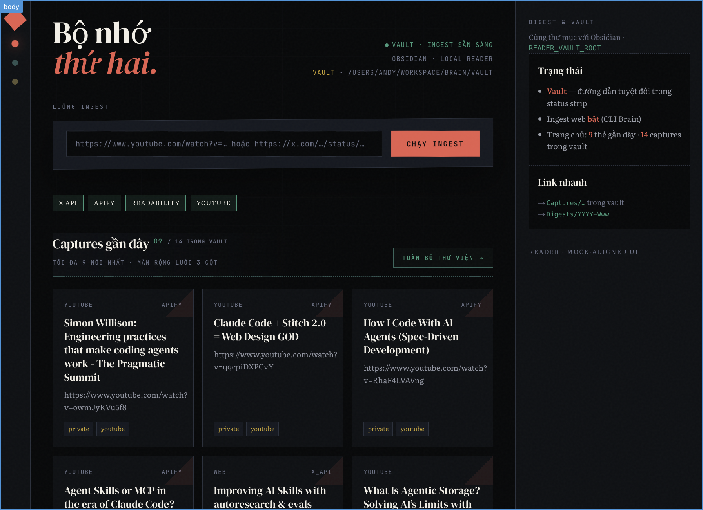
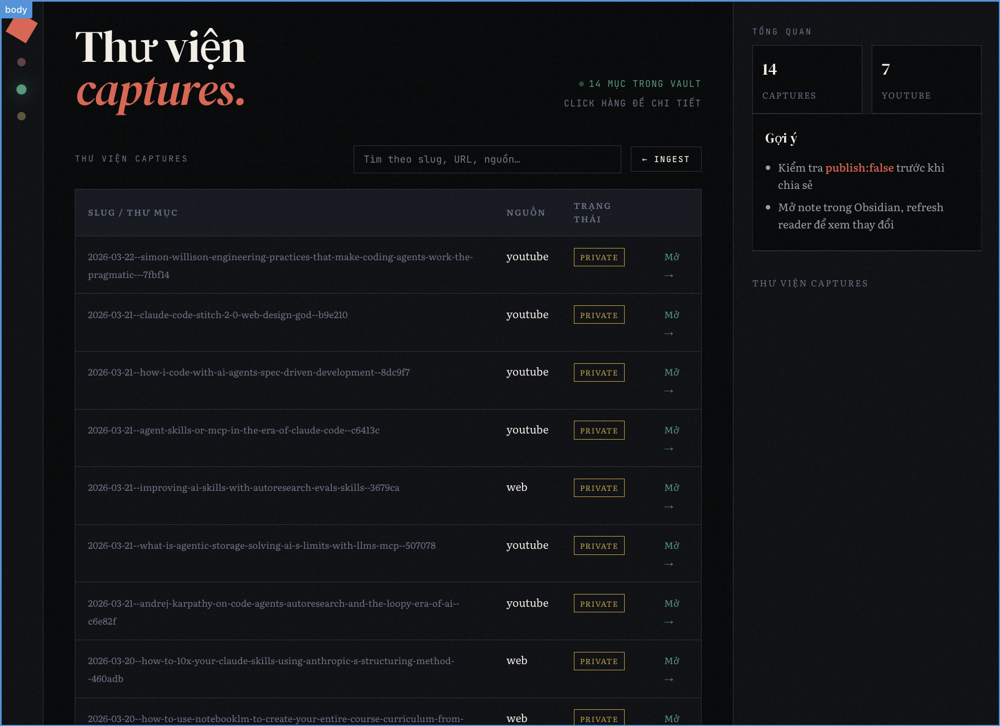

# Second brain CLI

TypeScript CLI that ingests URLs into an **Obsidian vault** (`Captures/…`) and optionally enriches notes with **OpenAI**. Routing is YAML: HTTP + Readability, Apify actors, or an X API stub. **CLI source** lives under [`cli/src/`](cli/src/) (root `package.json` runs `tsx cli/src/cli.ts …`). The optional reader UI is in [`reader-web/`](reader-web/).

## Setup

```bash
pnpm install
cp config/routing.example.yaml config/routing.yaml   # adjust routes / actor IDs
touch .env   # create at repo root; add keys from the Environment table (never commit .env)
```

- **Vault root:** `VAULT_ROOT` (default `./vault` relative to the current working directory when you run the CLI).
- **Routing:** the CLI loads `config/routing.yaml` if present, otherwise `config/routing.example.yaml`.
- **Secrets:** chỉ điền key thật trong **`.env`** ở root repo (file này **đã `.gitignore`**, không lên git). CLI tự load `.env` qua `dotenv`. Không commit file env mẫu — khai báo biến theo bảng **Environment** bên dưới.

## Commands

| Command | Description |
|--------|-------------|
| `pnpm ingest -- <url>` | Ingest one URL (fetch → normalise → `Captures/…` → optional images). With `OPENAI_API_KEY`: LLM sections on `note.md`; for **YouTube**, Vi transcript batch runs automatically when transcript segments exist. |
| `pnpm exec tsx cli/src/cli.ts ingest [options] <url>` | **Recommended** when passing options (avoids pnpm injecting an extra `--` into argv). Use `--progress-json` for machine-readable phase lines on stderr (Reader SSE). |
| `pnpm translate-transcript -- --capture vault/Captures/…` | Add or replace `## Transcript (vi)` on an existing capture. |
| `pnpm suggest-milestones -- --capture vault/Captures/… --max-sec 600` | Merge LLM-suggested `milestones.yaml` (YouTube). |
| `pnpm test` / `pnpm typecheck` | Tests and TypeScript check. Tests live in **`cli/tests/`** (ingest CLI) and **`reader-web/tests/`** (reader); both run from the repo root via Vitest. |
| `pnpm verify-keys` | Kiểm tra nhanh **OpenAI** / **Apify** / **X** bearer (đọc `.env`, không in key). |
| `pnpm verify-apify-youtube` | Thử **APIFY_TOKEN** + chạy actor YouTube trong routing trên một video mặc định (tốn Apify). `pnpm verify-apify-youtube --token-only` chỉ kiểm tra token. Có thể truyền URL: `pnpm verify-apify-youtube 'https://youtu.be/…'`. |
| `pnpm verify-x-tweet [id]` | Gọi `GET /2/tweets/:id` (app-only). Mặc định id ví dụ nếu không truyền. |

Thư mục **`vault/`** mặc định **gitignore** (dữ liệu cá nhân).

## Environment

| Variable | Required | Purpose |
|----------|----------|---------|
| `OPENAI_API_KEY` | For LLM | Summaries on `note.md` and **default** YouTube transcript EN→VI batch when segments exist. |
| `OPENAI_MODEL` | No | Default `gpt-4o-mini`. |
| `ENRICH_MODEL` | No | Optional model **only** for ingest note enrichment (else `OPENAI_MODEL`). |
| `ENRICH_MAX_CHARS` | No | Max chars of `source.md` body for enrich (default 12000; long text uses head+tail). |
| `ENRICH_TEMPERATURE` | No | Temperature for ingest note enrichment only (0–2; default `0.3` when unset/invalid). |
| `ENRICH_MAX_COMPLETION_TOKENS` | No | Max output tokens for enrich completion only (256–32000; default `4096`). |
| `APIFY_TOKEN` | For Apify routes | Actor runs. |
| `X_BEARER_TOKEN` | For X routes (later) | Full X adapter is not implemented yet. |
| `VAULT_ROOT` | No | Vault directory. |
| `CAPTURE_IMAGE_MAX_BYTES` | No | Per-image download cap (default 2_000_000). |
| `YT_TRANSLATE_BATCH` | No | Transcript translation: lines per OpenAI call (default 20). |
| `YT_TRANSLATE_MODEL` | No | Optional model override for translation only. |

## Testing integrations (OpenAI / Apify / X)

1. **`pnpm verify-keys`** — gọi API nhẹ (OpenAI `models.list`, Apify `user().get`, X `users/me`) để xác nhận token đọc được từ `.env`.

2. **`pnpm verify-apify-youtube`** — đọc `APIFY_TOKEN` từ `.env`. Thêm `--token-only` để chỉ gọi `user().get()`. Không flag: chạy actor YouTube trong `config/routing.yaml` trên một video mẫu (tốn compute); hoặc truyền URL YouTube làm đối số.

3. **Ingest thật** — tránh `pnpm run ingest -- --flag1 --flag2 <url>` (pnpm có thể chuyển thêm một `--` xuống argv và làm Commander báo “too many arguments”). Ưu tiên:

   ```bash
   pnpm exec tsx cli/src/cli.ts ingest https://example.com
   ```

   Hoặc: `pnpm run ingest -- https://example.com`.

4. **OpenAI trong ingest:** đặt `OPENAI_API_KEY` trong `.env` để có section LLM trên `note.md`. **YouTube:** cùng key đó, ingest tự dịch transcript sang Vi khi có segment (xem `YT_TRANSLATE_BATCH` / `YT_TRANSLATE_MODEL`).

5. **Apify:** cần URL khớp route `apify` trong `config/routing.yaml` + `actorId` hợp lệ + `APIFY_TOKEN`. Với **`youtube.com` / `youtu.be`**, CLI gọi luồng **YouTube transcript**: actor phải trả về transcript (field dạng `subtitles` / `captions` / `transcript` / `text` — xem `cli/src/adapters/youtube.ts`). Pin actor **YouTube có transcript** trong Apify Console; có thể dùng cùng `actorId` cho cả hai host trong `routing.example.yaml`.

6. **X trong CLI:** ingest URL `…/status/<id>` — API v2 với `tweet.fields=note_tweet,article`. **Note tweet:** nếu `note_tweet.text` dài hơn `text` → chỉ dùng API. **X Article:** object `article` thường chỉ có `title` (tier Basic); nếu có thêm field nội dung (`text`, `markdown`, …) thì dùng luôn. Có `article.title` thì **không** scrape `x.com/i/article` (hay bị chặn); capture ghi title + link. Link ngoài X vẫn fetch HTTP + Readability. `pnpm verify-x-tweet [id]` để xem JSON.

## Apify adapter (website-style actors)

The default sample actor id is `apify/website-content-crawler`. The adapter maps the **first dataset item** using, in order:

- `text` or `markdown` → `textPlain`
- optional `title`
- optional `screenshotUrl` → first image entry

Pin your own **Actor ID** and optional **build** in `config/routing.yaml`.

## Apify + YouTube (transcript)

Khi host là `youtube.com` hoặc `youtu.be` và route là `apify`, ingest dùng **`ingestYouTubeViaApify`**. Trong routing, **`youtubeInput`** quyết định JSON gửi vào actor:

- **`urls`** — `{ urls: [url], language, includeAutoGenerated, mergeSegments }` (mặc định trong `routing.example.yaml` cho actor Store [`automation-lab/youtube-transcript`](https://apify.com/automation-lab/youtube-transcript), trả `segments` / `fullText`).
- **`start_urls`** (mặc định nếu không khai báo) — `{ startUrls: [{ url }] }` cho actor kiểu crawler.

Dataset: lấy **item đầu**, map `segments`, `subtitles`, `fullText`, v.v. Nếu không có chữ nào, CLI báo lỗi.

## Reader web (not this repo)

The **reader web app** is in [`reader-web/`](reader-web/) (`pnpm dev` after `pnpm install` there). `POST /api/ingest` runs the same CLI entrypoint via `node …/tsx/dist/cli.mjs cli/src/cli.ts ingest` in `READER_BRAIN_ROOT` (not `pnpm run ingest --`, for the argv reason above). HTML mocks under [`docs/visualizations/`](docs/visualizations/) informed the layout — see [`docs/reader-web.md`](docs/reader-web.md). This CLI only writes Markdown to the vault; **Quartz** is not part of the stack.

### Reader web screenshots

Home (ingest + recent captures):



Captures library:



## MVP limits

- **X / Twitter:** X API v2 + X Article khi có `X_BEARER_TOKEN` (và tuỳ chọn cookies cho CDN ảnh).
- **YouTube:** ingest transcript qua **Apify**; dịch Vi / milestones / reader UI — xem plan (đã có trong repo).
- **Meta Threads (threads.net):** không hỗ trợ ingest (bỏ scope).
