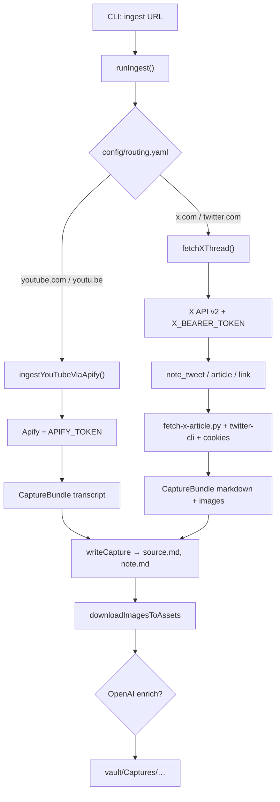

# Luồng ingest: YouTube & X.com → Obsidian Vault

Bản **Excalidraw** (mở bằng plugin Excalidraw trong Obsidian, hoặc [excalidraw.com](https://excalidraw.com)): cùng thư mục với file này — [`ingest-youtube-x.excalidraw`](ingest-youtube-x.excalidraw).

**Cập nhật sơ đồ:** chỉnh trực tiếp [`ingest-youtube-x.excalidraw`](ingest-youtube-x.excalidraw) trong Excalidraw (plugin Obsidian hoặc [excalidraw.com](https://excalidraw.com)).

> **Lưu ý:** Bản sao cũng có thể nằm trong vault tại `vault/Diagrams/ingest-youtube-x.excalidraw`, nhưng thư mục `vault/` bị gitignore nên **không hiện trong file tree** của Cursor/IDE.

## Sơ đồ (Mermaid)

**Preview trong Cursor/VS Code:** bản xem Markdown mặc định **không** render Mermaid. Cài extension [**Markdown Preview Mermaid Support**](https://marketplace.visualstudio.com/items?itemName=bierner.markdown-mermaid) (Cursor sẽ gợi ý khi mở repo nhờ `.vscode/extensions.json`), rồi mở lại Markdown preview. Hoặc dán khối dưới vào [mermaid.live](https://mermaid.live).

## Tham chiếu code

- `cli/src/ingest/runIngest.ts`
- `cli/src/adapters/youtube.ts`, `cli/src/adapters/xApi.ts`
- `docs/handoffs/2026-03-20-x-ingest-open-issues.md`
