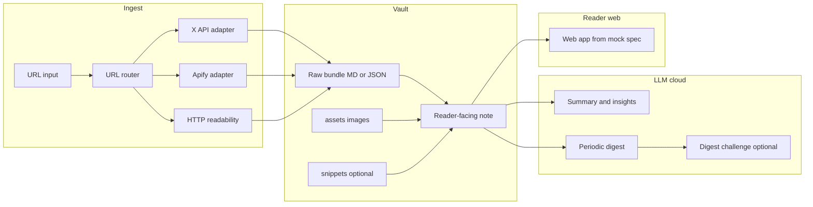

# Second brain (Obsidian + CLI + Apify/X API) — thiết kế tổng hợp

Tài liệu thiết kế đã duyệt. Triển khai chi tiết: [2026-03-20-second-brain-implementation-plan.md](./2026-03-20-second-brain-implementation-plan.md) — trong đó có **rà soát design ↔ task**, checklist tiến độ `[ ]` MVP (Task 1–12) và Phase 2+.

## Đã chốt từ brainstorm

- **Người dùng / vận hành:** chỉ bạn, kích hoạt thủ công (dán URL / chạy CLI).
- **“Trending”:** **digest định kỳ** (văn bản tổng hợp), mặc định đề xuất **hàng tuần** (cấu hình được).
- **Lưu trữ & đọc chi tiết:** **Obsidian vault** là nguồn sự thật (SSoT) cho capture, digest, evidence.
- **Đọc tổng hợp trên web:** **ứng dụng web** xây theo spec **mock** trong `docs/visualizations/` (ingest, thư viện captures, digest, chi tiết…) — **không dùng Quartz**; chi tiết sâu vẫn mở trực tiếp trong Obsidian khi cần.
- **LLM:** **API cloud** cho tóm tắt / insight / digest.
- **Thu thập:** ưu tiên **ổn định**; **X API** cho nhánh X khi đủ quyền; **Apify** (actor **pin version**) cho độ đầy đủ và ít tự maintain scraper; **HTTP/readability** cho web đơn giản khi đủ.
- **Độ đầy đủ:** giữ **bản gốc (evidence)** gồm text, ảnh tải về vault, code snippet (fenced hoặc file phụ); LLM là **lớp phân tích**, không thay thế raw.

## Kiến trúc logic



### Thành phần chính

1. **CLI** (TypeScript / Node — xem implementation plan): `ingest <url>`, `digest --since …`; **Phase 2+:** `challenge --digest …` / `--week …` (sinh câu hỏi từ digest); **YouTube:** tùy chọn `--translate-transcript vi` (hoặc lệnh dịch transcript sau ingest).
2. **Router:** map host/path → `strategy` + tham số actor Apify (id, version, input template).
3. **Normaliser:** đưa mọi nguồn về **schema nội bộ** chung trước khi ghi vault.
4. **Vault writer:** tạo thư mục theo ingest, ghi file, cập nhật frontmatter.
5. **Obsidian CLI:** tùy chọn cho tìm kiếm / thao tác batch; không bắt buộc cho MVP nếu ghi file trực tiếp đủ.
6. **LLM service:** prompt có cấu trúc, tách **facts (trích)** vs **inference**; nhánh tùy chọn **challenge từ digest** (đọc hiểu, không thêm fact).
7. **Reader web (ngoài phạm vi CLI MVP):** app đọc / tổng hợp theo `docs/visualizations/second-brain-mock-ui.html` (và tài liệu liên quan), nguồn dữ liệu là vault (đọc file, hoặc API sau này) — **không** dùng Quartz hay SSG wiki từ vault.

## Luồng dữ liệu chi tiết

### Ingest một URL

1. Parse URL → chọn adapter theo **bảng routing** (config YAML/JSON trong repo).
2. Fetch:
   - **X:** X API nếu đủ; nếu không, Apify actor X/Twitter đã pin (chi phí/ToS actor do bạn chấp nhận).
   - **YouTube / web:** Apify actor tương ứng **đã duyệt**, hoặc HTTP+readability cho bài báo tĩnh. *(Meta Threads không nằm trong scope — nội dung ngắn, không ưu tiên như article.)*
3. Chuẩn hoá output → **bundle**: `source.md` (full text) và/hoặc `content.raw.json` + `note.md`.
4. **Ảnh:** tải về `assets/`, đặt tên ổn định, ghi `source_url` + hash trong frontmatter hoặc manifest nhỏ.
5. **Code:** snippet ngắn inline; dài → `snippets/xxx.ext` + link.
6. Gọi LLM: sinh **Summary**, **Insights**, **Open questions**; ghi rõ “Suy luận (LLM)” vs “Trích từ nguồn”.
7. Ghi `fetch_method`, `actor_id`, `actor_build`, `retrieved_at`, `publish: true|false` (mặc định `false` cho full archive khi lo bản quyền lúc public).

### YouTube: transcript & trang web (embed + Anh / Việt) — Phase 2+

**Mục đích:** Người dùng đọc **cùng một capture** trong **Obsidian** (chi tiết đầy đủ) hoặc trong **reader web** với **video nhúng** và **transcript**; tùy chọn **song ngữ** (gốc thường là Anh + bản **Tiếng Việt** hỗ trợ đọc).

**Lưu vault (cùng bundle capture, không tách app riêng)**

- Frontmatter gợi ý: `source: youtube`, `youtube_video_id`, `transcript_locale: en` (hoặc danh sách), `transcript_translated_locales: [vi]` khi có bản dịch.
- `source.md`: section rõ ràng, ví dụ `## Transcript (en)` — **evidence** từ transcript API / actor; `## Transcript (vi)` hoặc file `source.transcript.vi.md` — chỉ khi có bước dịch, ghi nhãn **“Bản dịch (LLM)”** để không nhầm với lời thoại gốc.
- `assets/`: thumbnail chuẩn hoá nếu actor trả về URL (tuỳ chọn).

**Dịch Việt**

- Tuỳ chọn CLI sau ingest: ví dụ `ingest … --translate-transcript vi` hoặc lệnh riêng `translate-transcript --capture …` — gọi LLM **chỉ** dựa trên đoạn transcript đã lưu, output vào section / file đã nói ở trên.

**Hiển thị trên reader web (theo mock UI)**

- **Đọc cá nhân:** view capture trong app render **iframe embed** (`youtube.com/embed/VIDEO_ID`) + khối transcript; UI **tab** (EN | VI) hoặc **hai cột** (song song) — dữ liệu parse từ vault (Markdown / frontmatter), không qua Quartz.
- **Bản quyền / phạm vi hiển thị:** transcript đầy đủ có thể nhạy cảm với bản quyền; giữ **`publish: false`** trong vault khi không muốn đưa vào bất kỳ bản export nào; reader web chỉ chạy local / riêng tư thì rủi ro chủ yếu là thói quen chia sẻ URL — vẫn nên tôn trọng ToS YouTube và fair use nếu sau này có bản public.

**Timeline & mốc chú ý (tua nhanh)**

- **Mục đích:** Hiển thị **mốc thời gian** đáng chú ý (chapter, ý chính, đoạn quote) trên một **thanh timeline** và/hoặc danh sách chip; **bấm mốc** → video **seek** tới `t` (giây hoặc `mm:ss`).
- **Nguồn dữ liệu:** file `milestones.yaml` trong bundle capture, hoặc `youtube_milestones` trong frontmatter (mảng `{ t, label, highlight?: boolean }`). Có thể **LLM gợi ý** từ transcript đã lưu — ghi rõ lớp *gợi ý*, không coi là fact mới.
- **Kỹ thuật seek:** **YouTube IFrame API** (`seekTo`) hoặc **đổi URL embed** `?start={seconds}&autoplay=1` (đơn giản, có reload). Đồng bộ tuỳ chọn: highlight dòng transcript có cùng timestamp.

**Nguyên tắc:** Cùng **layout capture** trong app với các nguồn khác; khác biệt là block **video + transcript + timeline** trong UI reader, không cần generator site tĩnh riêng.

### Digest định kỳ

1. Quét note có `type: capture` (hoặc tag) trong cửa sổ thời gian.
2. Đưa vào LLM: **metadata + excerpt** (chunk/hierarchical nếu vượt context).
3. Tạo note `Digests/YYYY-Www.md`: theme lặp, mâu thuẫn, “đang nóng”, link về note gốc.

### Challenge / kiểm tra đọc hiểu (từ digest) — bổ sung

**Mục đích:** LLM sinh bộ câu hỏi **bám sát nội dung đã có trong một digest** (và mức excerpt/metadata đã dùng khi tạo digest), để người dùng **tự kiểm tra mức độ nắm chủ đề** — không nhằm tạo thông tin mới.

**Nguyên tắc**

- **Grounding:** Câu hỏi + đáp án tham chiếu chỉ dựa trên **văn bản digest** (và tùy chọn đoạn excerpt đã embed/link trong digest), tránh “kiến thức ngoài luồng”.
- **Tách lớp:** Ghi rõ đây là **lớp luyện tập / đọc hiểu (LLM)**; không ghi nhầm là evidence hay nguồn gốc mới.
- **Hình thức (gợi ý):** trắc nghiệm ngắn, câu hỏi mở (“giải thích bằng lời của bạn”), liên kết theme ↔ capture (nhận diện), mức độ khó cấu hình được (`easy` / `mixed` / `hard`).
- **Chấm điểm (tùy chọn):** tự đối chiếu với **đáp án gợi ý** trong vault; hoặc lần gọi LLM sau để so khớp câu trả lời tự do với digest (có chi phí + cần prompt an toàn để không bịa thêm fact).

**Lưu vault (đề xuất)**

- `Digests/YYYY-Www.challenge.md` **hoặc** `Challenges/YYYY-Www.md` với frontmatter `digest: "[[Digests/YYYY-Www]]"`, `type: challenge`, `generated_at`, `model`.
- Phần trả lời của người dùng có thể tách file `Reviews/YYYY-Www-answers.md` hoặc cùng note (section riêng) tùy thói quen PKM.

**CLI (sau MVP digest)**

- Lệnh kiểu `challenge --digest Digests/2026-W12.md` hoặc `--week 2026-W12` → đọc digest → ghi file challenge.
- Tuỳ chọn `--reveal-answers` / `--no-answers` (chỉ câu hỏi trước khi làm bài).

**Publish:** Mặc định `publish: false` nếu challenge lặp lại nội dung nhạy cảm từ digest private.

## Cấu trúc vault (đề xuất)

```
vault/
  Captures/
    YYYY-MM-DD--slug--shortid/
      _meta.yaml         # optional
      source.md          # full text / thread flattened
      note.md            # đọc + LLM + wikilinks
      assets/
      snippets/
  Digests/
  Challenges/          # optional: challenge sinh từ digest
  Reviews/             # optional: câu trả lời / tự chấm
  Templates/
```

Frontmatter tối thiểu: `type`, `source`, `url`, `ingested_at`, `fetch_method`, `publish`, `tags`. Với YouTube (khi bật): thêm `youtube_video_id`; tùy chọn `transcript_translated_locales` (vd. `vi`); tùy chọn `youtube_milestones` (JSON) hoặc file `milestones.yaml` bên cạnh `source.md`.

## Xử lý lỗi

- **Fetch fail:** note stub `status: failed`, log lỗi; không gọi LLM hoặc LLM chỉ mô tả thiếu dữ liệu.
- **Apify timeout / partial:** lưu partial + `incomplete: true`.
- **Retry:** idempotent theo `canonical_url` + `content_hash`.

## Bảo mật & cấu hình

- API keys: **chỉ env** (`X_*`, `APIFY_TOKEN`, `OPENAI_*` / `ANTHROPIC_*`), không commit vào vault.
- Repo: `.env.example` + `.gitignore` cho `.env`.

## Kiểm thử (mức thiết kế)

- **Golden fixtures:** JSON mẫu từng adapter → normaliser → snapshot Markdown.
- **Contract tests** cho router (URL → strategy).
